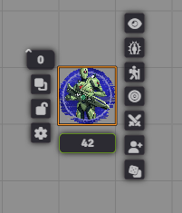
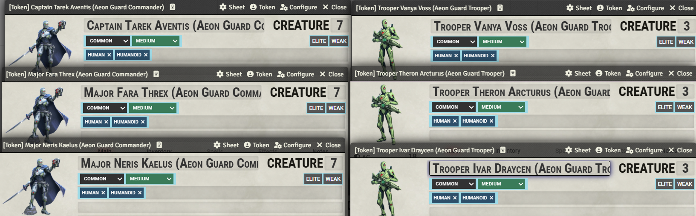
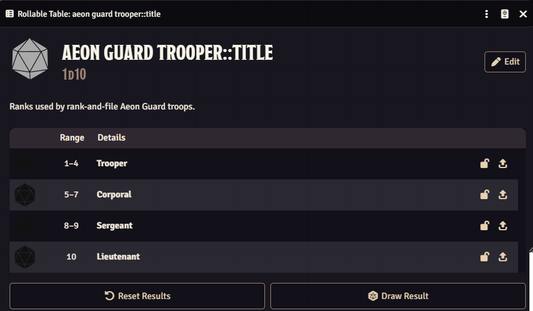
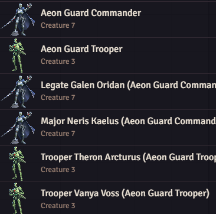

# Albarytu NPC Tools

A Foundry VTT utility module for turning disposable NPC tokens into more usable scene companions and story characters.

The module is built around two GM workflows:

- automatically assigning names to generic unlinked NPC tokens from RollTables
- promoting a disposable token into a real persistent Actor without losing its current state

The design is intentionally system-agnostic. It does not assume a specific ancestry or naming scheme. Instead, it looks for tables by actor traits and languages, and it prefers world content over module content. Tested with PF2E/SF2E.

---

## Automatic NPC naming

### Trigger conditions

Names are generated only when all of the following are true:

- the token is unlinked (i.e. it's not already a unique world actor)
- the token name matches the underlying actor name (i.e. token name hasn't been customized)
- a valid name can be rolled from matching RollTables

This guard is important: if a token was manually renamed, or if it is linked to a real Actor, the module leaves it alone.

### Candidate table names

The module builds a list of candidate tokens from the token's actor data. The order is intentionally specific-to-general:

1. `templateName` (original name of the actor)
2. `ancestry-language`
3. `ancestry`

For example, if the actor is an Aeon Guard Trooper, and is a human speaker of Azlanti, the candidates could look like:

- `aeon guard trooper`
- `human-azlanti`
- `human`

The code gets these values from the token actor's traits and languages and then searches for matching RollTables with suffixes:

- `::title`
- `::first`
- `::last`

So a table named `human::first` can be used for a first name, while `aeon guard trooper::title` can supply a title or rank.

`aeon guard trooper::first` table in this case would take precedence over `human-azlanti::first`, and that over `human::first`, if all those tables existed.

### How tables are found

The module searches for tables in two places:

- the world tables collection first
- then compendium RollTables

The check is case-insensitive and the table name has to match exactly as a string, such as `human::first`.

If a table is not found in either location, the module simply tries the next candidate instead of failing immediately.

### Name generation

Each name is assembled from three parts:

- title
- first name
- last name

The generated result is then combined as:

- `Title First Last (TemplateName)`

For example:

- `Lieutenant Vanya Voss (Aeon Guard Trooper)`

If any part is missing, the module still uses the components that exist. If no components exist, then the original template name is left untouched.

### Uniqueness enforcement

Once a generated name is built, the module checks whether it is already used by:

- another token in the current scene
- an Actor in the world

If it collides, the module re-rolls the naming up to 10 times. If a unique name is not found, it falls back to the original actor name and warns the GM.

This is a safety check to avoid creating duplicate character names.

### Re-roll feature

When an unlinked token has received a generated name, the module adds a  button to that token's HUD. Clicking it re-runs the same naming logic against the same token.

This allows e.g. copy-pasting the unlinked token multiple times, and assigning a new name to each token.

---

## Promote token to Actor

The second major feature is promoting an unlinked NPC token into a persistent Actor.

This is triggered from a  button in the Token HUD (only available for unlinked tokens).

### What gets preserved

When the GM clicks the promotion action, the module does the following:

- creates a new Actor from the token's current actor data
- removes the temporary Actor ID from the cloned data
- preserves the effective current state of the token actor, including HP, conditions, and other actor data
- links the token to the new Actor
- updates the new Actor's prototype token data to match the new actor's details

The module also preserves the token's display mode, but if the token was set to `NONE`, it upgrades it to `OWNER_HOVER` to keep the new permanent character easier to identify.

### Prototype token updates

The new Actor gets its prototype token updated to:

- use the actor name
- use linked actor data
- show the new display name behavior

This makes the promoted character behave like a proper persistent NPC rather than a temporary token-only entity.

---

## Module behavior summary

This module is intentionally small and data-driven rather than hardcoded. It assumes the GM will provide useful RollTables for naming, and it does not require bespoke ancestry lists.

The module also favors world-authored tables over module-provided tables, so a campaign can override the defaults without editing the module itself.

---

## Design goals

- system agnostic
- data driven
- RollTable based
- no hardcoded naming conventions
- no hardcoded ancestry assumptions
- world content takes precedence over module content
- supports both generic scene NPCs and story-important characters

---

## Companion content packs

This module contains the logic, not the actual naming data.

The naming tables are intentionally expected to live in separate modules or packs, such as:

- Albarytu NPC SF2E Tables
- Albarytu NPC PF2E Tables

That keeps the behavior reusable while allowing each campaign or system to provide its own naming tables independently.
